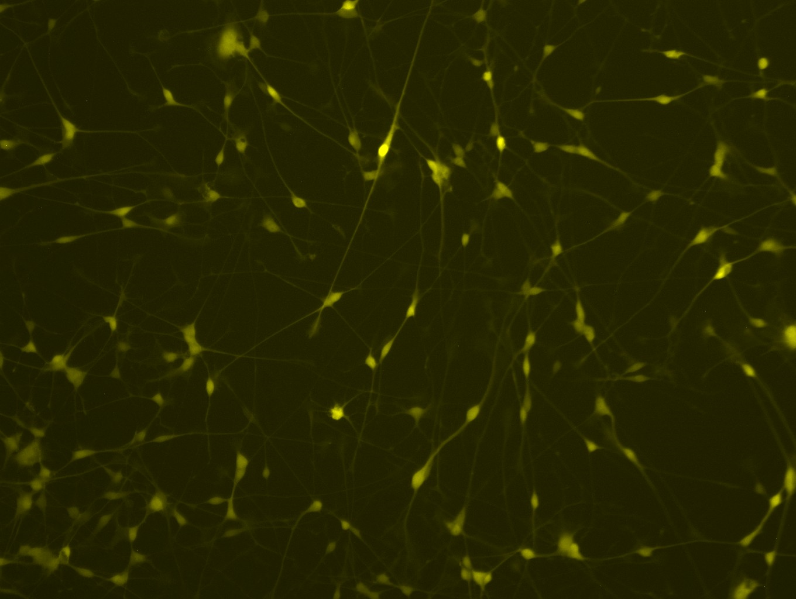

# Real Time Stem Cell Neurogenesis Tracker
## Introduction
This project contains the source code to split video footage of stem cell neurogenesis into frames, analyze each frame of the video, identify the neurons and axons of the stem cells, and create a map of the neural network formed. 

The final goal of this project is to perform the analysis on real time video footage. Once the neural network formation is understood, the stem cell axon connections can be manipulated via lasers to create controlled, custom nervous tissue. 

## Cell Body Identification
The first part of this project identifies the cell bodies using watershed thresholding algorithms and assigns each cell body an identification number. The algorithm analyzes differences between consecutive frames in order to track cell bodies across the frames. 

## Cell Axon Identification
The second part of this project identifies the cell axons. The cell bodies are filtered out of the image. Axons are identified and cases of crossing axons are handled by a new algorithm that estimates axon orientation. The cells that the axons connect are also identified and stored in a matrix as well as displayed visually in a graph-theory map with nodes (cell-bodies) and edges (axons). This algorithm can be found in axonID.m

## Sample Images

### Original Video Frame

